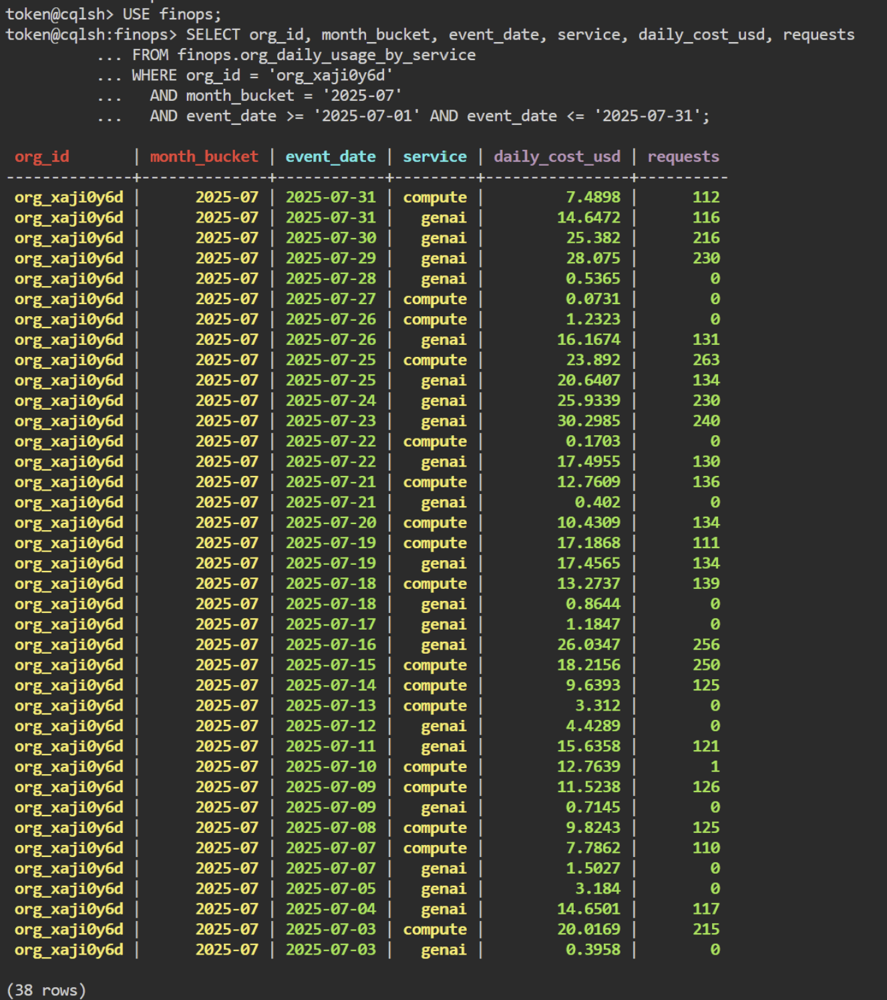
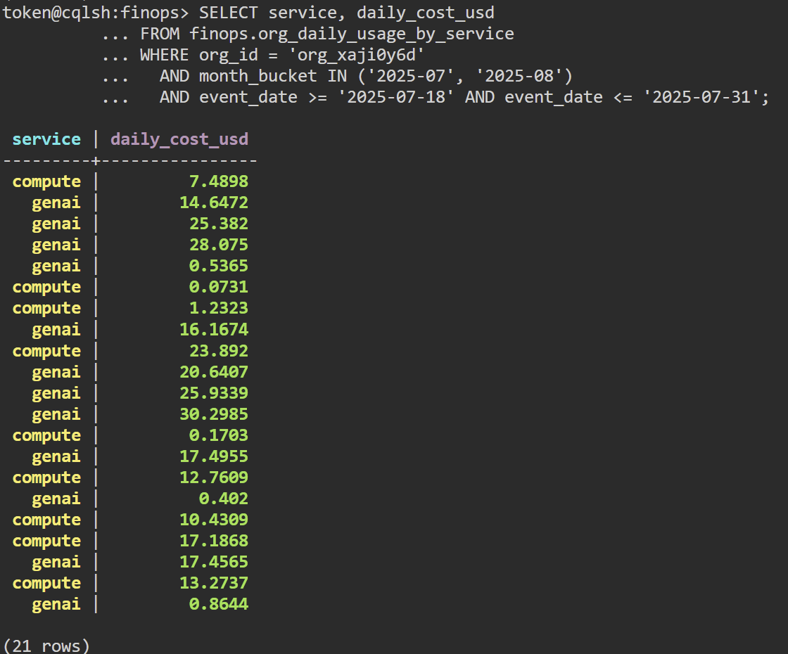
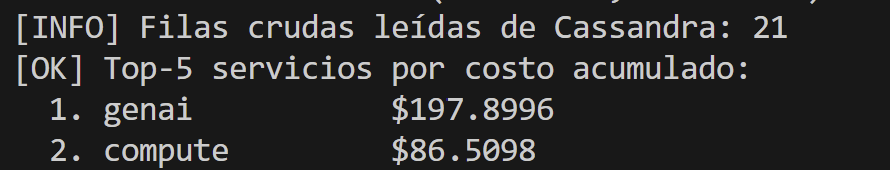

# Detalles Técnicos del Data Lake y Decisiones de Diseño

Este documento contiene la explicación técnica detallada de cada capa del Data Lake, la estructura de directorios resultante, los criterios de aceptación y el log de decisiones arquitectónicas.

Para ver las instrucciones de instalación y los comandos de ejecución, consultar el [README.md](README.md).

---

## 1. Detalles Técnicos de las Capas

### Parte 1: Batch -> Bronze (PySpark)
**Script principal:** `batch_landing_to_bronze.py`

#### Qué hace el script:
- Lee los 3 maestros CSV mínimos desde `datalake/landing` con esquema explícito (sin inferencia): `customers_orgs`, `users`, `billing_monthly`.
- Agrega columnas técnicas:
  - `ingest_ts`
  - `source_file`
  - `batch_date`
- Escribe Bronze en formato Parquet con particionado sensato por tabla:
  - `billing_monthly`: `month`
  - `customers_orgs` y `users`: sin partición (tablas pequeñas)
- Aplica controles básicos de calidad: filtro `NOT NULL` sobre claves críticas.
- Genera manifest de control con conteos de lectura, post-calidad, post-dedupe y escritura.
- Es idempotente por partición: reescribe las particiones objetivo del lote ejecutado.

#### Salidas esperadas:
Parquet Bronze por tabla (mínimo requerido):
- `billing_monthly`: `datalake/bronze/batch/billing_monthly/month=YYYY-MM-DD/`
- `customers_orgs`: `datalake/bronze/batch/customers_orgs/` (sin partición)
- `users`: `datalake/bronze/batch/users/` (sin partición)
- Manifest de corrida: `datalake/bronze/_control/batch_date=YYYY-MM-DD/manifest.json`

---

### Parte 2: Streaming -> Bronze (Structured Streaming)
**Script principal:** `streaming_landing_to_bronze.py`

#### Qué hace el script:
- Lee `usage_events_stream/*.jsonl` con Structured Streaming.
- Usa esquema explícito unificado para `schema_version` 1 y 2.
- Aplica `withWatermark` sobre `event_ts` para tolerancia de eventos tardíos.
- Aplica dedupe por `event_id`.
- Envía a `quarantine` registros inválidos (corruptos, `event_id`/`event_ts` nulos y errores de casteo de `value`).
- Habilita checkpointing para tolerancia a reinicios.
- Agrega columnas técnicas:
  - `ingest_ts`
  - `source_file`
  - `batch_date`
- Escribe Parquet particionado por `event_date`.

#### Salidas esperadas:
- Bronze streaming: `datalake/bronze/streaming/usage_events/event_date=YYYY-MM-DD/`
- Quarantine inválidos: `datalake/bronze/quarantine/usage_events_invalid/batch_date=YYYY-MM-DD/`
- Checkpoints: `datalake/checkpoints/streaming_landing_to_bronze/`

---

### Parte 3: Bronze -> Silver
**Script principal:** `bronze_to_silver.py`

#### Qué hace el script:
- Lee eventos desde Bronze streaming con `readStream` y 1 maestro desde Bronze batch (`customers_orgs`).
- Aplica limpieza/conformance de tipos y campos (`event_ts`, `value_num`, `metric`, `unit`, costos).
- Aplica join de enriquecimiento por `org_id` con datos de organización.
- Activa reglas de calidad:
  - `event_id` no nulo.
  - `event_id` único.
  - `cost_usd_increment >= -0.01` (se mantiene en Silver con `anomaly_cost_flag`).
  - `unit` no nulo cuando `value` existe.
- Envía registros con fallas duras a `quarantine` y guarda muestras.
- Genera features diarias por `event_date`, `org_id`, `service` con agregación streaming, watermark y ventana diaria:
  - `daily_cost_usd`
  - `requests`
  - `genai_tokens_total`
  - `carbon_kg_total`
- Escribe Silver con `writeStream` en modo append y checkpoints.

#### Salidas esperadas:
- Silver enriquecido: `datalake/silver/events_enriched/event_date=YYYY-MM-DD/`
- Silver features: `datalake/silver/features_org_daily/event_date=YYYY-MM-DD/`
- Quarantine: `datalake/silver/quarantine/events_quality_issues/event_date=YYYY-MM-DD/`
- Muestras de quarantine: `datalake/silver/quarantine/samples/`
- Manifest: `datalake/silver/_control/manifest.json`
- Checkpoints: `datalake/checkpoints/bronze_to_silver/`

---

### Parte 4: Silver -> Gold 
**Script principal:** `silver_to_gold.py`

#### Qué hace el script:
- Lee `datalake/silver/features_org_daily` con `readStream`.
- Construye el mart FinOps `org_daily_usage_by_service` (grano diario por org/servicio).
- Calcula y publica métricas/costos de negocio para serving:
  - `daily_cost_usd`
  - `requests`
  - `genai_tokens_total`
  - `carbon_kg_total`
  - `events_count`
  - `anomaly_events_count`
  - `quality_score`
- Agrega `month_bucket` para modelado query-first en Cassandra.
- Escribe Gold con `writeStream` en modo append y checkpoint.

#### Salidas esperadas:
- Gold mart: `datalake/gold/org_daily_usage_by_service/event_date=YYYY-MM-DD/`
- Manifest: `datalake/gold/_control/manifest.json`
- Checkpoint: `datalake/checkpoints/silver_to_gold/`

---

### Parte 5: Gold -> Serving (Cassandra)
**Script principal:** `gold_to_serving_cassandra.py`

#### Qué hace el script:
- Lee el mart Gold `org_daily_usage_by_service` como Structured Streaming.
- Genera automáticamente los archivos CQL de schema y consultas (query-first).
- En modo dry-run valida conteos y deja los artefactos CQL sin escribir en Cassandra.
- En modo `--write-serving` inserta los datos en Cassandra via `foreachBatch + cassandra-driver`.
- Soporta **dos modos de conexión**: local Docker o AstraDB cloud.

#### Salidas esperadas:
- CQL schema: `cql/01_schema_finops.cql`
- CQL queries: `cql/02_queries_finops.cql`
- Tabla poblada: `finops.org_daily_usage_by_service`

---

## 2. Evidencias de Aceptación

### 1) Batch y Streaming ejecutan con datos provistos
- Batch a Bronze ejecutado correctamente con conteos y manifest en `datalake/bronze/_control/batch_date=.../manifest.json`.
- Streaming a Bronze ejecutado correctamente en modo availableNow con micro-batches, con salida en:
  - `datalake/bronze/streaming/usage_events/`
  - `datalake/bronze/quarantine/usage_events_invalid/`
  - Watermark activo para tolerancia de eventos tardíos.

### 2) Reglas de calidad y quarantine efectivas
- Silver aplica reglas de calidad activas (event_id, costo mínimo, unit cuando value existe).
- Manifest Silver generado en `datalake/silver/_control/manifest.json`.
- Se valida que el pipeline completa y publica datasets Silver:
  - `datalake/silver/events_enriched/`
  - `datalake/silver/features_org_daily/`
  - `datalake/silver/quarantine/events_quality_issues/`

### 3) Mart FinOps en Gold
- Mart `org_daily_usage_by_service` generado en `datalake/gold/org_daily_usage_by_service/`.
- Manifest Gold en `datalake/gold/_control/manifest.json`.

### 4) Serving en Cassandra poblado
- Carga a Cassandra realizada con resultado exitoso en `finops.org_daily_usage_by_service`.

### 5) Consultas mínimas sobre Cassandra
- **Query #1** (partición completa por org + month_bucket) devuelve múltiples filas ordenadas por clustering keys (`event_date DESC`, `service ASC`):
  ```sql
  SELECT * FROM finops.org_daily_usage_by_service
  WHERE org_id = 'org_xaji0y6d' AND month_bucket = '2025-07';
  ```
- **Query #2** (Top-N servicios por costo acumulado en los últimos 14 días):
  Se ejecuta recuperando las filas del rango mediante CQL y agrupando/ordenando del lado del cliente en memoria.

Capturas de las consultas ejecutadas en AstraDB:

**Query #1 — CQL Console:**


**Query #2 — CQL Console:**


**Query #2 Top-N acumulado vía `query2_top_n_demo.py`:**


### 6) Idempotencia y particionado — evidencia
- Al final de cada script se imprime `[VERIFY] <dataset> total_rows=<n>`.
- Re-ejecutar con la misma entrada y misma configuración produce exactamente los mismos conteos sin duplicados físicos.
- Serving usa clave primaria natural `PRIMARY KEY ((org_id, month_bucket), event_date, service)`, garantizando UPSERTS idempotentes.
- Evidencia detallada de rutas, tamaños de particiones y conteos antes/después de reruns: [doc/idempotencia_particiones.pdf](doc/idempotencia_particiones.pdf).

---

## 3. Log de Decisiones Arquitectónicas

1. **Patrón de Arquitectura:** Se mantiene Lambda: flujo batch para maestros y flujo streaming para eventos de uso.
2. **Formatos por Zona:** Bronze/Silver/Gold en Parquet particionado para eficiencia y velocidad de lectura.
3. **Calidad de Datos:** En Silver se aplican reglas hard-fail que aíslan a quarantine y reglas soft-fail que marcan con flag de anomalía.
4. **Modelo de Serving (Query-First):** Cassandra modelado estrictamente para consultas por organización y mes (`org_id`, `month_bucket`) y drill-down por fecha/servicio para garantizar tiempos de respuesta ultra-bajos.
5. **Deduplicación y Regla de Unicidad (`dq_event_id_unique`):** En Structured Streaming, las fallas de duplicación de `event_id` ocurren por reintentos de red legítimos y no por corrupción estructural de datos. Por ende, la deduplicación se realiza de forma nativa a nivel de motor de streaming con `withWatermark` y `dropDuplicates(["event_id"])`. La regla en la capa de calidad se fija estáticamente en `True` para evitar enviar falsos positivos a la cuarentena física.
6. **Particionado por capa:**
   - **Bronze batch maestros:** `billing_monthly` → `month` (consultas por período de facturación). `customers_orgs` y `users` → sin partición: tablas pequeñas (80 y 800 filas) leídas siempre completas como broadcast en Silver, el particionado no aporta pruning y solo generaría archivos diminutos.
   - **Bronze streaming:** `event_date` — las queries de Gold filtran por rango de fechas del evento, no por fecha de ingestión. Permite partition pruning en Silver y Gold. Cardinalidad acotada y predecible (un directorio por día).
   - **Silver y Gold:** `event_date` — coherente con el grano diario de las features y del mart FinOps. La idempotencia en reruns se logra con `partitionOverwriteMode=dynamic` que reescribe solo las particiones afectadas.
7. **Limitaciones de Serving en Cassandra (Consulta Top-N):** Cassandra no soporta agrupamiento ni ordenamiento dinámico por métricas en tiempo de ejecución. Pre-calcular las sumas de ventanas de tiempo en una tabla dedicada en Cassandra no es viable ni escalable cuando los usuarios de los dashboards solicitan ventanas dinámicas (ej. últimos 7, 14 o 30 días, cuyos datos acumulados cambian diariamente). Por lo tanto, se implementó el patrón recomendado en NoSQL: la consulta CQL extrae el rango de fechas en disco (O(1) usando la clave de partición por organización y mes) y delega la agregación (SUM por servicio) y ordenamiento final (Top-N) a la capa del cliente.
