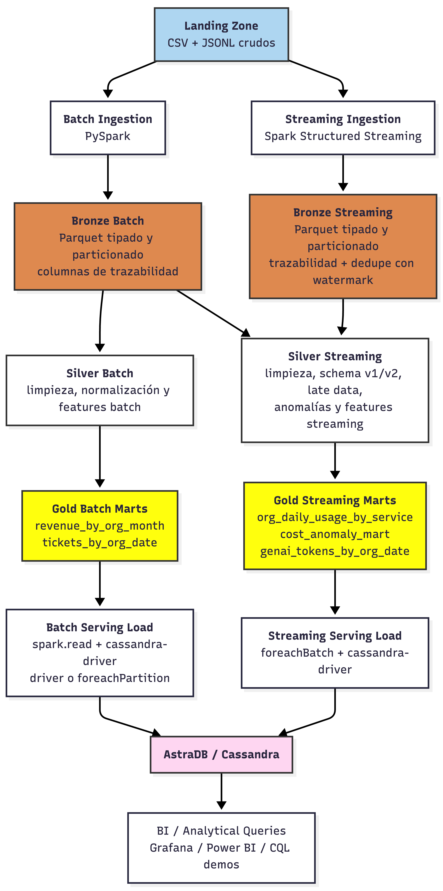

# Detalles Técnicos del Data Lake y Decisiones de Diseño

Este documento contiene la explicación técnica detallada de cada capa del Data Lake, la estructura de directorios resultante, los criterios de aceptación y el log de decisiones arquitectónicas.

Para ver las instrucciones de instalación y los comandos de ejecución, consultar el [README.md](README.md).

---

## Arquitectura

---

## 1. Detalles Técnicos de las Capas

### Parte 1: Ingesta Batch -> Bronze (PySpark)
**Script principal:** `batch_landing_to_bronze.py`

#### Qué hace el script:
- Lee los maestros CSV desde `datalake/landing` con esquema explícito (sin inferencia): `customers_orgs`, `users`, `billing_monthly`, y `support_tickets`.
- Agrega columnas técnicas:
  - `ingest_ts`
  - `source_file`
  - `batch_date`
- Escribe Bronze en formato Parquet con particionado sensato por tabla:
  - `billing_monthly`: particionado por `month`.
  - `support_tickets`: particionado por `year` y `month` (según `created_at`).
  - `customers_orgs` y `users`: sin partición (tablas maestras pequeñas).
- Aplica controles básicos de calidad: filtro `NOT NULL` sobre claves críticas.
- Genera manifest de control con conteos de lectura, post-calidad, post-dedupe y escritura.
- Es idempotente por partición: reescribe las particiones objetivo del lote ejecutado.

#### Salidas esperadas:
Parquet Bronze por tabla:
- `billing_monthly`: `datalake/bronze/batch/billing_monthly/month=YYYY-MM-DD/`
- `support_tickets`: `datalake/bronze/batch/support_tickets/year=YYYY/month=MM/`
- `customers_orgs`: `datalake/bronze/batch/customers_orgs/`
- `users`: `datalake/bronze/batch/users/`
- Manifest de corrida: `datalake/bronze/_control/batch_date=YYYY-MM-DD/manifest.json`

---

### Parte 2: Ingesta Streaming -> Bronze (Structured Streaming)
**Script principal:** `streaming_landing_to_bronze.py`

#### Qué hace el script:
- Lee `usage_events_stream/*.jsonl` con Structured Streaming.
- Usa esquema explícito unificado para `schema_version` 1 y 2.
- Aplica `withWatermark` sobre `event_ts` para tolerancia de eventos tardíos.
- Aplica dedupe por `event_id`.
- Envía a `quarantine` registros inválidos (corruptos, `event_id`/`event_ts` nulos y errores de casteo de `value`).
- Habilita checkpointing para tolerancia a reinicios.
- Agrega columnas técnicas:
  - `ingest_ts`
  - `source_file`
  - `batch_date`
- Escribe Parquet particionado por `event_date`.

#### Salidas esperadas:
- Bronze streaming: `datalake/bronze/streaming/usage_events/event_date=YYYY-MM-DD/`
- Quarantine inválidos: `datalake/bronze/quarantine/usage_events_invalid/batch_date=YYYY-MM-DD/`
- Checkpoints: `datalake/checkpoints/streaming_landing_to_bronze/`

---

### Parte 3: Bronze -> Silver

#### A. Pipeline de Streaming (Eventos de Uso)
**Script principal:** `bronze_to_silver.py`

- Lee eventos desde Bronze streaming con `readStream` y 3 tablas maestras desde Bronze batch (`customers_orgs`, `users`, y `resources`).
- Aplica limpieza/conformance de tipos y campos (`event_ts`, `value_num`, `metric`, `unit`, costos).
- Aplica joins de enriquecimiento multi-tabla:
  - Join con `customers_orgs` por `org_id` (datos de organización).
  - Join con `users` pre-agrupados por `org_id` (para obtener `total_org_users` y `active_org_users` sin duplicar filas del stream de eventos).
  - Join con `resources` por `resource_id` (trayendo `resource_state` y `resource_tags_json`).
- Activa reglas de calidad:
  - `event_id` no nulo y único.
  - `cost_usd_increment >= -0.01` (se mantiene en Silver con `anomaly_cost_flag`).
  - `unit` no nulo cuando `value` existe.
- Envía registros con fallas duras a `quarantine` y guarda muestras.
- **Cálculo Estadístico de Anomalías (Z-Score)**:
  - Para calcular el Z-Score sobre `daily_cost_usd` en Structured Streaming (que prohíbe funciones de ventana tradicionales), se implementa un **Static-to-Stream Join**.
  - Se leen de forma estática los históricos acumulados de Bronze para calcular la media (`mean`) y la desviación estándar (`stddev`) del costo por `service`.
  - Este histórico estático se une por `service` con las features calculadas por el stream diario.
  - Se calcula `z_score = (daily_cost_usd - mean) / stddev`.
  - Se genera `anomaly_zscore_flag = True` si `abs(z_score) > 3.0` (indicando desviación estadística de 3 sigmas).
- Escribe Silver con `writeStream` en modo append y checkpoints.

##### Salidas esperadas:
- Silver enriquecido: `datalake/silver/events_enriched/event_date=YYYY-MM-DD/`
- Silver features: `datalake/silver/features_org_daily/event_date=YYYY-MM-DD/`
- Quarantine: `datalake/silver/quarantine/events_quality_issues/event_date=YYYY-MM-DD/`
- Muestras de quarantine: `datalake/silver/quarantine/samples/`
- Checkpoints: `datalake/checkpoints/bronze_to_silver/`

#### B. Pipeline Batch (Facturación y Soporte)
**Script principal:** `batch_bronze_to_silver.py`

- Lee los datasets `billing_monthly` y `support_tickets` de la capa Bronze batch.
- **Para Facturación (Billing)**:
  - Normaliza la moneda a USD utilizando la tasa de cambio (`exchange_rate_to_usd`) del registro.
  - Genera `revenue_usd`, `credits_usd` y `taxes_usd`, imputando nulos con `0.0`.
  - Reglas de calidad: `org_id` y `month` no nulos, y `revenue_usd > 0`. Los registros inválidos van a la cuarentena batch.
  - Escribe en `datalake/silver/billing_monthly_normalized/` particionado por `month`.
- **Para Soporte (Tickets)**:
  - Valida reglas de calidad: `ticket_id` no nulo, severidad válida (`low`, `medium`, `high`, `critical`), CSAT en rango `[1.0, 5.0]` (o nulo).
  - Extrae la fecha de creación `created_date` a partir de `created_at`.
  - Agrupa por `org_id`, `created_date` y `severity`.
  - Calcula las features diarias por severidad: cantidad de tickets (`ticket_count`), promedio de CSAT (`csat_avg`), y tasa de breach de SLA (`sla_breach_rate`).
  - Escribir en `datalake/silver/tickets_by_org_date/` particionado por `created_date`.

---

### Parte 4: Silver -> Gold

#### A. Pipeline de Streaming (Marts Operativos)
**Script principal:** `silver_to_gold.py`

Lee de forma incremental `silver/features_org_daily` para generar 3 marts de Gold en paralelo:
1. **org_daily_usage_by_service**: Grano diario por org/servicio con costos, requests, GenAI tokens, huella de carbono y scores de calidad.
   - Path: `datalake/gold/org_daily_usage_by_service/`
2. **genai_tokens_by_org_date**: Filtra consumos del servicio `genai` y publica el volumen diario de tokens consumidos y su costo estimado.
   - Path: `datalake/gold/genai_tokens_by_org_date/`
3. **cost_anomaly_mart**: Filtra registros marcados con anomalía (costo negativo o Z-score > 3 sigmas) para análisis FinOps detallado.
   - Path: `datalake/gold/cost_anomaly_mart/`

#### B. Pipeline Batch (Marts de Negocio y Soporte)
**Script principal:** `batch_silver_to_gold.py`

Procesa los datasets normalizados de Silver batch de forma estática:
1. **revenue_by_org_month**: Agrupa la facturación a grano mensual por organización.
   - Calcula `net_revenue_usd = revenue_usd - credits_usd + taxes_usd`.
   - Registra el tipo de cambio promedio aplicado (`fx_applied`).
   - Path: `datalake/gold/revenue_by_org_month/` particionado por `month`.
2. **tickets_by_org_date**: Agrupa la actividad de soporte por organización y fecha.
   - Para cumplir con el requerimiento de colecciones en Cassandra, consolida el grano diario por organización compilando la distribución de severidades de tickets en una colección de tipo **Map** `map<text, int>` llamada `severity_breakdown` (ej. `{'critical': 1, 'high': 3, 'low': 10}`).
   - Calcula la tasa diaria total de SLA breach y el CSAT promedio diario.
   - Path: `datalake/gold/tickets_by_org_date/` particionado por `event_date`.

---

### Parte 5: Gold -> Serving (Cassandra)
**Script principal:** `gold_to_serving_cassandra.py`

#### Qué hace el script:
- Se conecta a la base de datos (soporta conexión local Docker `cassandra-local` o AstraDB Cloud).
- Ejecuta la creación del Keyspace y las 5 tablas DDL siguiendo el diseño **Query-First** en el Driver de Spark.
- Genera los artefactos CQL en la carpeta `cql/`.
- Carga los 5 marts Gold de forma idempotente (UPSERTS por clave primaria):
  - **Streaming Marts** (`org_daily_usage_by_service`, `genai_tokens_by_org_date`, `cost_anomaly_mart`): Utilizan `writeStream` con `foreachBatch` para escribir micro-lotes directamente.
  - **Batch Marts** (`revenue_by_org_month`, `tickets_by_org_date`): Se leen estáticamente y se escriben por partición de RDD (`rdd.foreachPartition`) para evitar checkpoints inútiles.

---

## 2. Evidencias de Aceptación

### 1) Batch y Streaming ejecutan con datos provistos
Todos los pipelines de datos ejecutan satisfactoriamente de punta a punta, estructurando el datalake y poblando Cassandra.

### 2) Reglas de calidad y quarantine efectivas
- Las validaciones duras (IDs nulos, tipos corruptos) envían registros a carpetas físicas de cuarentena tanto en streaming como en batch (`datalake/silver/quarantine/`).
- Las validaciones estadísticas marcan alertas enriquecidas sin interrumpir el flujo del negocio.

### 3) Los 5 Marts de Negocio en Gold
Los 5 datasets de Gold se generan en formato Parquet en las siguientes ubicaciones del Data Lake:
- `datalake/gold/org_daily_usage_by_service/`
- `datalake/gold/revenue_by_org_month/`
- `datalake/gold/tickets_by_org_date/`
- `datalake/gold/genai_tokens_by_org_date/`
- `datalake/gold/cost_anomaly_mart/`

### 4) Serving en Cassandra Poblado
Las 5 tablas se inicializan e insertan en Cassandra de forma idempotente. Los conteos de registros reflejan el total procesado:
- `finops.org_daily_usage_by_service`: 10,439 registros
- `finops.revenue_by_org_month`: 227 registros
- `finops.tickets_by_org_date`: 910 registros (con mapas de severidades poblados)
- `finops.genai_tokens_by_org_date`: 1,066 registros
- `finops.cost_anomaly_mart`: 160 registros

### 5) Consultas mínimas sobre Cassandra
Las consultas se validaron directamente en Cassandra local (`cqlsh`). Los resultados y el diseño de la clave primaria para cada una de ellas son:

- **Consulta #1: Costos y requests diarios por org/servicio en un rango de fechas**
  - Tabla: `finops.org_daily_usage_by_service`
  - Clave Primaria: `PRIMARY KEY ((org_id, month_bucket), event_date, service)` con ordenamiento por `event_date DESC, service ASC`.
  - Permite recuperar en O(1) los registros del mes.

- **Consulta #2: Top-N servicios por costo acumulado (últimos 14 días)**
  - Tabla: `finops.org_daily_usage_by_service`
  - Clave Primaria: `PRIMARY KEY ((org_id, month_bucket), event_date, service)`.
  - Se obtienen las filas correspondientes en CQL y la agregación/ordenación se ejecuta rápidamente en el cliente (como demuestra `query2_top_n_demo.py`).

- **Consulta #3: Evolución de tickets críticos y SLA breach por día (últimos 30 días)**
  - Tabla: `finops.tickets_by_org_date`
  - Clave Primaria: `PRIMARY KEY ((org_id, month_bucket), event_date)`.
  - El desglose por severidad se almacena como una colección `map<text, int>` (`severity_breakdown`), devolviendo toda la información diaria consolidada en una única fila por fecha.

- **Consulta #4: Revenue mensual con créditos e impuestos normalizado a USD**
  - Tabla: `finops.revenue_by_org_month`
  - Clave Primaria: `PRIMARY KEY ((org_id), month)`.
  - Permite listar en orden cronológico inverso (`month DESC`) el histórico mensual consolidado para facturación de la organización.

- **Consulta #5: Tokens GenAI y costo estimado por día**
  - Tabla: `finops.genai_tokens_by_org_date`
  - Clave Primaria: `PRIMARY KEY ((org_id, month_bucket), event_date)`.
  - Monitorea el consumo diario del servicio GenAI.

---

## 3. Log de Decisiones Arquitectónicas

1. **Patrón de Arquitectura Lambda**: Se optó por una arquitectura Lambda para balancear eficiencia y latencia. Los maestros del negocio y los datos estructurados por lotes (facturas mensuales y soporte) se procesan con scripts batch tradicionales evitando la complejidad de Structured Streaming, mientras que los eventos de uso se analizan en tiempo real mediante Structured Streaming.
2. **Uso de Colecciones en Cassandra (Maps)**: El enunciado solicita explícitamente el uso de Keyspaces con colecciones de Cassandra. En `tickets_by_org_date`, en lugar de duplicar registros y complejizar la clave primaria para desglosar la severidad del ticket por fila, se diseñó la columna `severity_breakdown` como un `map<text, int>`. Esto optimiza la lectura en O(1) de la fila diaria reduciendo el consumo de I/O en Cassandra.
3. **Cálculo de Anomalías con Z-Score**: Se implementó la detección estadística de anomalías de costo calculando el Z-Score por servicio. Para resolver la limitación de Structured Streaming sobre operaciones de ventana dinámicas complejas, se adoptó el patrón **Static-to-Stream Join**, donde las métricas de media y desviación estándar de referencia se calculan estáticamente a partir de los datos acumulados en Bronze y se cruzan con el stream en tiempo real.
4. **Idempotencia basada en Upserts de Cassandra**: Al diseñar las tablas con claves de partición naturales (`org_id`, `month_bucket`, `event_date`, `service`), cualquier ejecución repetida de los pipelines simplemente actualiza los valores existentes en lugar de duplicar registros, garantizando la idempotencia completa de punta a punta.
5. **Separación de Serving Batch vs Streaming**: Para los pipelines batch de Serving, el uso de Spark Structured Streaming con parquet file source generaría checkpoints innecesarios y una simulación continua ineficiente sobre tablas estáticas. Se resolvió la carga mediante `spark.read` estático acoplado a escrituras mediante `RDD.foreachPartition` directamente a Cassandra, mejorando el consumo de recursos.
6. **Enriquecimiento Multi-Tabla en Streaming sin Duplicados**: Para realizar los joins obligatorios con `orgs`, `users` y `resources`, se pre-agruparon los datos de `users` estáticamente por `org_id` antes del join, calculando métricas a nivel org (`total_org_users`, `active_org_users`). Esto evita el producto cartesiano y mantiene la unicidad y consistencia de los eventos de uso en el stream. Los recursos se unieron directamente por la clave primaria `resource_id`.
7. **Cálculo de CPU y Storage Hours**: Se agregaron las columnas `cpu_hours` y `storage_gb_hours` al mart Gold operativo diario mediante el mapeo selectivo de las métricas correspondientes en la agregación por ventana diaria de PySpark, cubriendo la totalidad de las métricas de uso requeridas por el enunciado.

